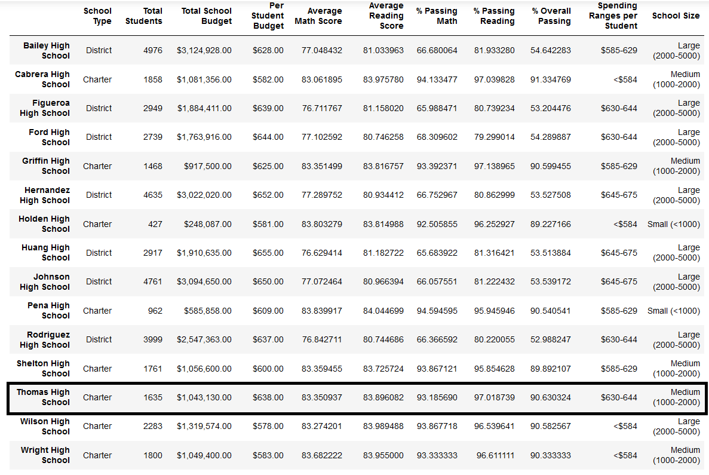
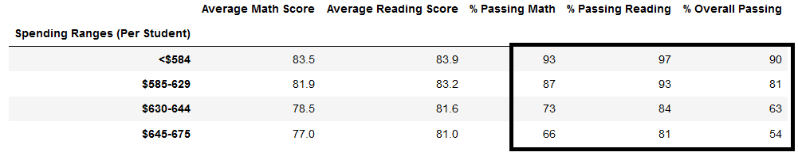
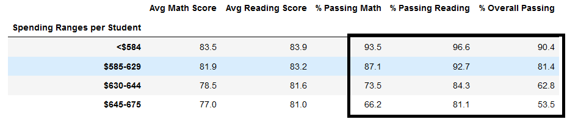

# School_District_Analysis
## Overview
The purpose of this analysis was to investigate how removing test scores for 9th graders at Thomas High School (THS) would affect the district-wide testing results. The School Board has expressed concern over potential academic dishonesty in Thomas High School's reporting of its 9th graders' reading and math scores and wants to see if there is a signficant difference in the results without those suspicious scores in the testing analysis.

## Results
If we take a look at the final DataFrame of our analysis, we can see that removing the suspicious 9th grade scores has very little effect on THS's metrics.

Closer inspection of certain metrics reveals that removing the suspicious data did have slight noticeable, if not statistically significant, effects.

One example can be seen in the % Passing Math, % Passing Reading, and % Overall Passing columns for spending ranges. 

## Summary
The fact that there were so few and such small changes to the results makes since when we look at the big picture. No matter how badly the scores for THS's 9th grade class might have been fabricated, those scores only represent 461 students out of a total of 39,170 in the district. 

Despite this, the following four changes in the district numbers were noted:
- The average math score decreased by 0.1%
- The percentage of students passing math decreased by 0.2%
- The percentage of students passing reading decreased by 0.3%
- The overall passing percentage decreased by 0.1%
